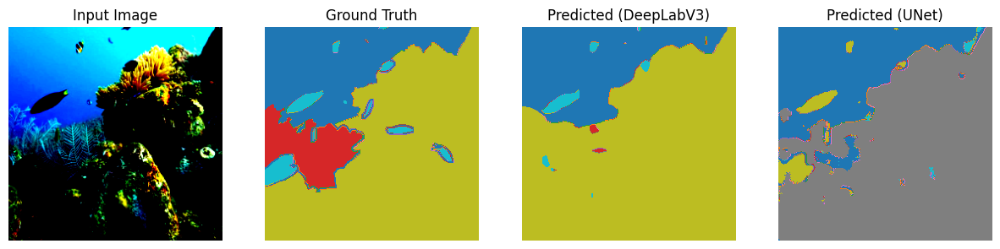
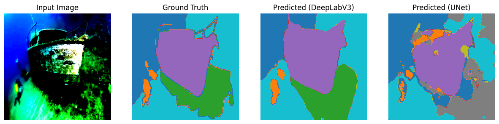
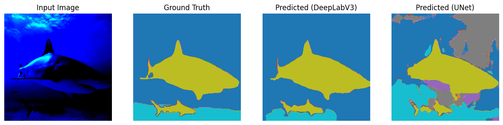
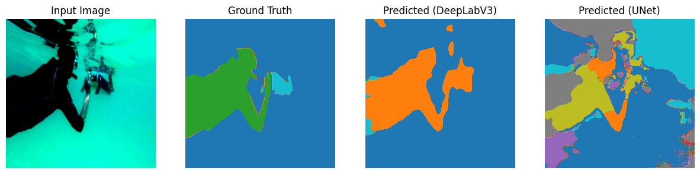

# PROJET : Segmentation sémantique de fond marins:

 ## About the SUIM Dataset
 •
We used the [SUIM Dataset](http://irvlab.cs.umn.edu/resources/suim-dataset) which is great for underwater scenes. It's got different types of objects marked with unique colors.


 | Object category             | Symbol | RGB color code        |
|-----------------------------|--------|-----------------------|
| Background (waterbody)      | BW     | 000 (black)           |
| Human divers                | HD     | 001 (blue)            |
| Aquatic plants and sea-grass| PF     | 010 (green)           |
| Wrecks and ruins            | WR     | 011 (sky)             |
| Robots (AUVs/ROVs/instruments)| RO   | 100 (red)             |
| Reefs and invertebrates     | RI     | 101 (pink)            |
| Fish and vertebrates        | FV     | 110 (yellow)          |
| Sea-floor and rocks         | SR     | 111 (white)           |

### Folder structure:

- `train_val/` contains 1525 paired samples for training/validation
  - `images/`: RGB images of underwater scenes
  - `masks/`: segmentation labels
    - Each RGB color represents a different object category
    - Further details in the paper (Section III)

- `TEST/` contains 110 paired samples for benchmark evaluation
  - `images/`: RGB test images
  - `masks/`: ground truths labels
    - Combined RGB masks are provided
    - Individual binary masks are also provided in separate folders

## Models:


For the segmentation task, two different neural network architectures were utilized to analyze and compare their performance:

- **U-Net**: The U-Net architecture, renowned for its effectiveness in biomedical image segmentation, was chosen for its symmetric structure and skip connections that facilitate precise localization. This characteristic makes U-Net particularly well-suited for underwater scene segmentation where the clear distinction between categories is crucial. The U-Net implementation was adapted from a repository on GitHub, which can be accessed [here](https://github.com/mkisantal/backboned-unet/tree/master).
Don't forget to Install package:

Installing package:


    cd backboned-unet
    pip install .


- **DeepLabV3**: On the other hand, the DeepLabV3 architecture incorporates atrous convolutions to handle multi-scale information, a feature that has proven highly effective for semantic image segmentation tasks. Its ability to segment complex underwater environments, where object categories vary significantly in scale and appearance, was harnessed using the implementation in `torchvision.models.segmentation`. This facilitated leveraging the model's capabilities directly within the PyTorch framework.


For training DeepLabV3, launch the following command: (also refer to main.py for additional arguments)

```bash
python main.py --model_name "DeepLabV3" --batch_size 16 --p 0.2  

```


## Experiences & Training dynamics


### U-Net Model


| Model     | Backbone Name | Learning Rate | Epochs |Batch size| Data Aug Percentage | 
|-----------------|---------------|------------|---|------------------|------------------------------|
|UNet_1 | densenet121    | 0.0001     | 50   | 16  | 0                | **84.41%**   | **49.25%**  |
|UNet_2| densenet121      | 0.0001    | 50   |  16 | 0.2                | 84.02%    | 48.08% |
|UNet_3| resnet50      | 0.0001    | 50   |  16 | 0                | 84.39%   | 47.98% |
|UNet_4| resnet50      | 0.0001    | 50   |  16 | 0.2               | 


### DeepLabV3 Model

| Model  | Learning Rate | Number of Epochs |Batch Size| Data Aug Percentage |
|-------------|---------------|---------|---------|------------------------------|
|DeepLabV3_1|  0.001   | 50   | 8  | 0          | -     | -|
|DeepLabV3_2|  0.001  | 50  |  8 | 0.2                | 82.46%    | 52.38% |
|DeepLabV3_3|  0.001   | 50   |  16 | 0               | 80.78%    | 49.35% |
| DeepLabV3_4|  0.001    | 50    |  16| 0.2               | 77.01%    | 44.14%|
| DeepLabV3_5|  0.0001    | 50    | 8 | 0             | 83.81%    | **55.35%**|
| DeepLabV3_6|  0.0001    | 50    | 8 | 0.2            |**84.51%**   | 54.69%|
| DeepLabV3_7|  0.0001    | 50    | 16 | 0          |   84.10%  |54.38% |
| DeepLabV3_8|  0.0001    | 50    | 16 | 0.2          |   84.10%  |54.38% |


**Please use this [link](https://api.wandb.ai/links/iliasrami/unyzi3fx) for logs and scores**

### Comparative Analysis
Both models underwent rigorous training and validation cycles, with performance benchmarks regularly recorded. The results were compared based on metrics such as mean Intersection over Union (mIoU) and pixel accuracy, which provided insights into each model's strengths and weaknesses.

The experiments demonstrated valuable findings, highlighting the U-Net's proficiency in capturing detailed structures and DeepLabV3's robustness across varied


**UNet_3** stands out with the highest Mean IoU among all the models tested. This indicates that UNet can handle the diverse and complex features of underwater scenes well, especially when set up with the right hyperparameters and without data augmentation.


The impact of data augmentation on model performance is mixed, varying with different models and settings. This suggests that how effective augmentation is depends greatly on specific cases. More experiments are needed to find the best augmentation strategies for each scenario.


The findings imply that adjusting data augmentation methods, learning rates, and batch sizes might improve model performances. Also, it could be worthwhile to try out more varied or advanced backbone networks, particularly to enhance U-Net models.


When we looked at the average IoU score, it was lower than we hoped. This made us check the IoU for each type of object in our images. We found that objects that don't show up much in the pictures had lower IoU scores. This could mean our model isn't learning about these rare objects very well.

| Class       | Num Pixels| DeepLabV3_5|
|-------------|--------|--|
| Background  | 3098083  |83.21%|
| Human       | 191791   |71.66%|
| Plant       | 244268   |61.13%|
| Wreck       | 575905   |74.36%|
| Robot       | 42164   |11.59%|
| Reef        | 1312247  |65.29%|
| Fish        | 498325   |71.16%|
| Rocks       | 1246177  |64.65%|

To address this issue, we propose two potential avenues for improvement:

1. **Class Weighting in Loss Function**: Assigning higher weights to the under-represented classes in the loss function could encourage the model to pay more attention to these classes during training.

2. **Targeted Data Augmentation**: Specifically augmenting images that contain under-represented classes might balance the dataset more effectively.

Both strategies aim to provide a more balanced learning environment for the model, which could enhance its ability to correctly identify and segment the less frequent classes, leading to an improvement in the overall mIoU.


## Qualitative results and Visualization


|  | |
|-------------|--------|
|  ||
|      ||
|      ||
|       ||


